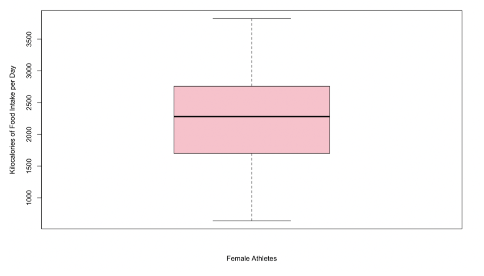
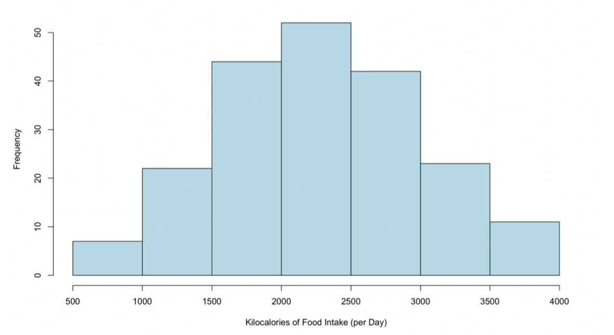

# Boxplot

We can see that the median is roughly 2200 kilocalories and the interquartile range shows us the spread of the data 
and we can see that it’s roughly between 1600 to 2750 kilocalories. The longer the box is the greater the spread of food intake values. 
The maximum value of the boxplot is roughly 3700 kilocalories and the minimum is roughly 400-600 kilocalories. 
There are no outliers in this boxplot which means all the food intake values are around the same values.

# Histogram

The median is about 2200-2350 kilocalories of food intake per day with a frequency that is roughly 
between the range of 50 to 55 which means there are about 50-55 female athletes falling in the median. 
The x-axis of the histogram represents the range of food intake values, while the y-axis represents the frequency or count of athletes falling within each food intake range. The 2000 to 2500 kilocalories of food intake per day has the maximum value of athletes which is between 50-55 people. 500-1000 kilocalories of food intake per day has the minimum value of athletes which is about 5-8 people. The shape of the histogram seems to be bell-shaped where the values increase from the left, hit a maximum, and then decrease to the right.

# Sample T-Test

We can be 95% confident that the true mean of food intake of female elite athletes lies between 2163.725 kilocalories to 2365.003 kilocalories.

# Specifying the Null and Alternative Hypothesis

H₀: μ = 2812 (true mean food intake for Canadian female high-performance athletes is equal)

Hₐ: μ ≠ 2812 (true mean food intake for Canadian female high-performance athletes differs)

There is strong evidence to reject the null hypothesis that the true mean is equal to 2812 kilocalories per day for female elite athletes. 
The p-value is 2.2e-16 indicating an extremely small probability.

# QQ Plot

